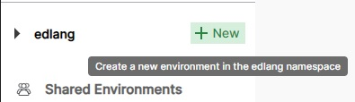
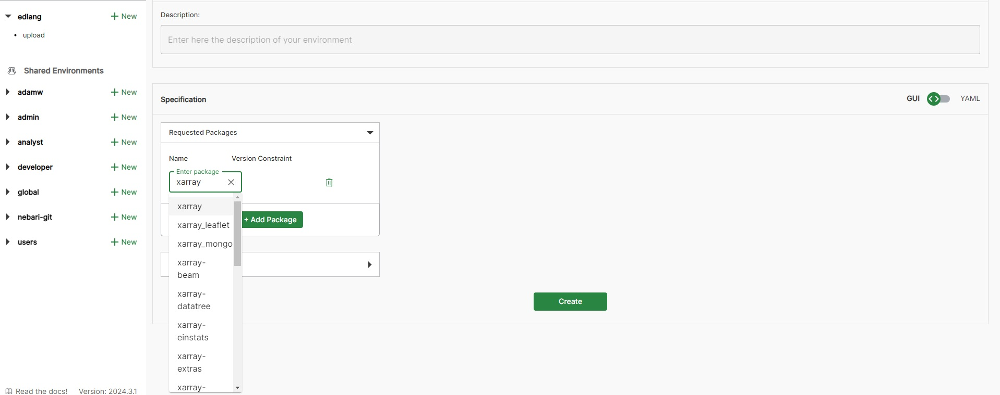
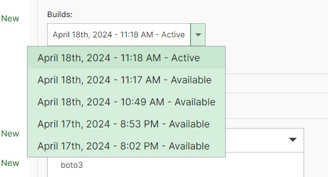

==========================
Conda Environment Creation
==========================

Jupyter notebooks run on a specific kernel, which corresponds to a particular running process of a programming language.  

We provide a general-use kernel that includes many popular Python libraries. However, you can create your own kernels with new Conda environments containing specific Python packages.  

You can change the kernel of any notebook by clicking the kernel name (default: "Python 3 (ipykernel)") in the top-right corner of the notebook interface.

Setting Up a New Kernel
-----------------------

The Airborne SMCE uses Conda Store to manage virtual environments. The Conda Store provides dedicated storage for Conda environments. **The dedicated storage is not unlimited, so please try not to create duplicate environments.** It is highly recommended to use Conda Store to create all virtual environments. Once an environment is created it can be edited in the Conda Store GUI however, packages can be installed via `conda install` or `pip`; however, these packages will not be tracked by Conda Store. Only install via the command line as a last resort. 

**NOTE:** Conda environments can also be created via the command line using `mamba create`; however, this is strongly discouraged. Creating large environments this way can be extremely slow. Installing large geospatial libraries can take up to an HOUR. Command-line-created environments will appear in your home directory.

.. _venv:

Creating a New Conda Environment
--------------------------------

* Navigate to **File → Hub Control Panel**, then click on **Conda Store** in the navigation bar at the top of the page.  

* Log in to Conda Store using your Airborne SMCE username and password.  

* Select **New Environment**:

    * If you want to create an environment for your personal use only, create it in your **personal namespace**.  
    
    * If you want others to have access to the environment, select the **global namespace**. Only admins can create global environments.

* Provide a name and description for your environment, then start adding packages by clicking **Add Package** and searching.  

    * Conda Store will automatically try to select the most recent version of Python that works with your specified libraries. If you require a different version, add Python as a package and select the version you want.  

    * If you have a preferred version of a package, use the interface to select the appropriate version.  

    * If you prefer not to use the GUI or have a YAML file from an existing environment, you can switch the GUI/YAML slider to import it.  

    * **Important: You must install the package `ipykernel` for your environment to appear as a kernel in JupyterHub.**

* If you would like to use the Dask Gateway, you also need to install the following packages::

        dask=2025.3.0
        distributed=2025.3.0
        dask-gateway=2025.4.0
        ipywidgets

* **NOTE:** It can take a little time for your environment to show up as an available kernel in JupyterHub. I recommend stopping and restarting your server if it does not show up in a few minutes!

Editing and Deleting a Conda Environment
----------------------------------------

* Select the environment you would like to edit

* Click edit in the top right corner

* If you would like to delete the environment, select delete environment in the bottom right

* Once you are finished save your changes and the environment will start to build

* **Changes can to an environment can take miniute or two to propogate to a notebook**

Rolling back a Conda Environment
--------------------------------
If you accidently install a package that breaks your environment Conda-Store has an easy to use
role back feature.

* Select edit and use the builds drop down menu to select a previous build

* Save the environment

