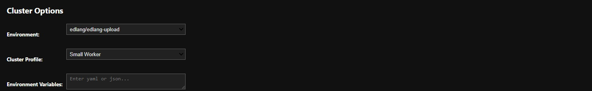
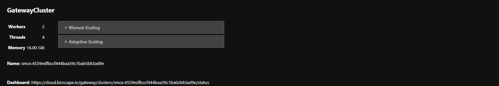
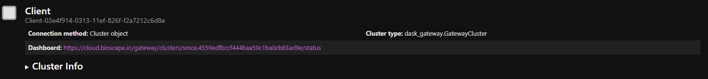

==================
Using Dask Gateway
==================

If you need extra compute resources the SMCE has the ability to spool up additional AWS EC2 worker nodes via Dask Gateway. 

Inorder to use Dask Gateway the following packages must be installed in your conda environment:

        * dask=2025.3.0
        * distributed=2025.3.0
        * dask-gateway=2025.4.0
        * ipywidgets

Users do not have access to the is feature by default. Ask an admin to grant you access.

::
    
    from dask_gateway import Gateway
    from distributed import Client

::

    gateway = Gateway()

Select the Python environment, size of worker nodes, and set any environment variables. Currently there are three options for workers nodes:

* Small worker
    
    * 1 core
    * 2 Gi Memory

* Medium worker
    
    * 2 cores
    * 4 Gi

* Large worker

    * 4 cores
    * 8 Gi 

Each cluster can have several worker nodes. It is recommended to start with the small worker.

::

    options = gateway.cluster_options()
    options

Wait until the cluster is created. The cluster is spooling up additional AWS EC2 instances. This can take a few minutes.

Scale the cluster to your required size.

**Note: You can easily spin up several EC2 instances, this generates extra costs so please be mindful and use this responsibly**

::

    cluster = gateway.new_cluster(options)
    cluster

The cluster can be monitored via the provided dashboard link. Currently, the dashboard runs on localhost.  

To access the dashboard:  

1. Launch a remote desktop from the Jupyter launcher.  

2. Open a terminal and type `firefox` to launch a browser.  

3. In the top-right corner of the virtual desktop, use the paste tool to paste the dashboard link and open it in Firefox.  

Use the Workers tab in the dashboard to monitor the cluster and check whether your workers are ready. From the dashboard you can monitor the progress of your Computations.

If you loose connection to your notebook **Do not start another cluster without checking to see if you previous cluster still exists**

The following code shows how to check for existing clusters and how to reconnect to them

**Starting a new cluster will start additional AWS compute resources**

::

    existing_clusters = gateway.list_clusters()
    existing_clusters

[]   

::

    cluster = cluster = gateway.connect(existing_clusters[0].name)
    cluster

The final step is to assign the cluster as your Dask Client. Once this is done any time you call compute the cluster will be used rather than your local compute resources.

::

    client = Client(cluster)
    client

After you are finished using the cluster make sure you shut everything down. It can take a few minutes to shut everything down.

::

    cluster.shutdown()
    client.close()