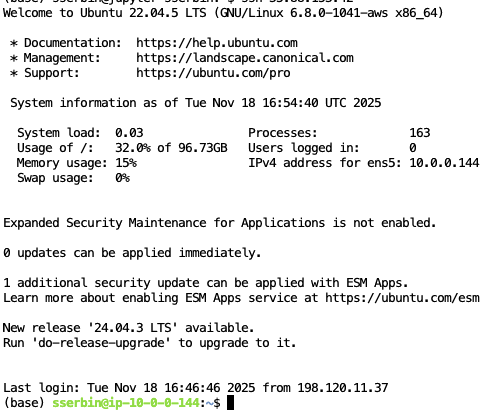

===============
Airborne AWS Parallel Cluster
===============

These work-in-progress instructions will be used to guide users how to utilize the Airbone PCluster resource (WIP)
**Note** These are very preliminary instructions that are actively being improved 

Logging In For the First Time
=============================

Setup your ssh keys to allow logging in from a local computer (without requiring access through the Jupyter Hub)

1.  Navigate to https://hub.airborne.smce.nasa.gov

2. Select as small server instance as you will only be using this to create your ssh key handshake

3. once logged in, open a terminal in the Jupyter Hub environment and ssh into the pcluster head node `ssh [ip_address_of_pcluster_head_node]`. You should see a screen similar to below:

4. Once l

